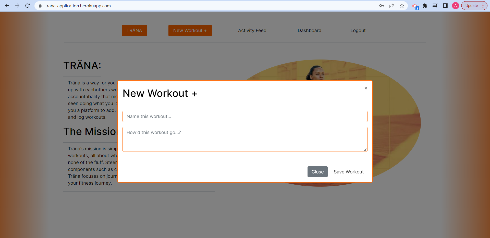
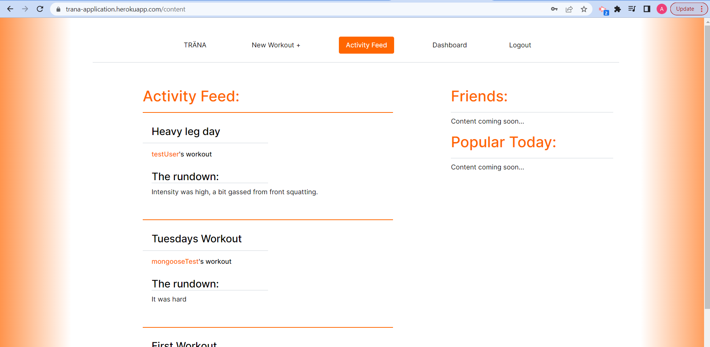
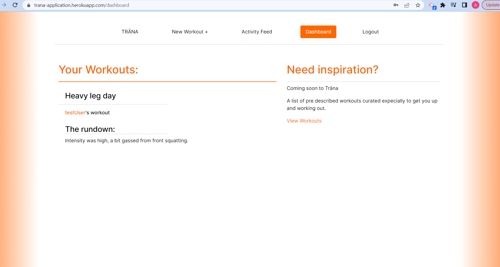

# TR&Auml;NA

## TR&Auml;NA is deployed [here](https://trana-application.herokuapp.com/dashboard)

---
## Table of contents
* [Description](#Description)
* [Functionality](#Functionality)
* [Installation](#Installation)
* [Technologies](#Technologies)
* [Credits](#Credits)
* [Questions](#Questions)
---
## Description
Tr&auml;na is a social media style post and read application built for people who exercise from beginner to advanced skill level. What tr&auml;na brings to the table is the ability to log you workouts with a title and description, but no likes or comments feature, IT'S ALL ABOUT THE WORKOUT. 
Tr&auml;na will continue to be developed into a more refined fully functional application in future versions.

---
## Functionality
Tr&auml;na uses a modal to create a new workout to post to the global activity feed. Once tr&auml;na gains more users, a friends or followers functionality will be implemented to only show those respective users in the activity feed.

Modal:

Global activity feed:

Once a user has posted their own workouts, they will be filtered onto their dashboard, where they can view the journaled workouts as they please. This is especially important when trying to progress in your workouts, remembering the wieght, sets or reps you did last week for example, just got a whole lot easier.

---
## Installation
After forking this project, run the `npm install` command in the rooy folder, this will install all needed packages. Next run `npm run seed` to access some dummy data to get coding!

---
## Technologies
Tr&auml;na is built with a MERNG tech stack meaning it utilises a MongoDB/Mongoose ODM for the database, Express.JS for the server handling, React.JS for the front end, and Node.JS as a web framework.

---
## Credits 
This project was created by myself with assistance from teachers and resources at the University of Sydney Full Stack Flex Online Part Time Bootcamp.

---
## Questions

Please also direct questions to: AndrewGavegan, https://github.com/AndrewGavegan and zzandrewzz@optusnet.com.au